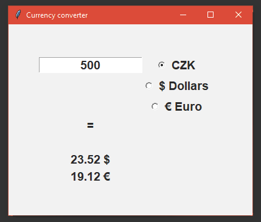

# Currency Converter

Handy currency converter actually working
with **static** exchange rates  
For actual exchange rates for CZK visit 
[this site](https://www.cnb.cz/en/financial-markets/foreign-exchange-market/central-bank-exchange-rate-fixing/central-bank-exchange-rate-fixing/)
.

---
### Supported currencies
* CZK 
* DOLLARS 
* EUROS
---

### Run this app in your browser
[Click here](https://repl.it/join/xzxlaybi-luknplava)
to run and see my app on **repl.it**.

---

